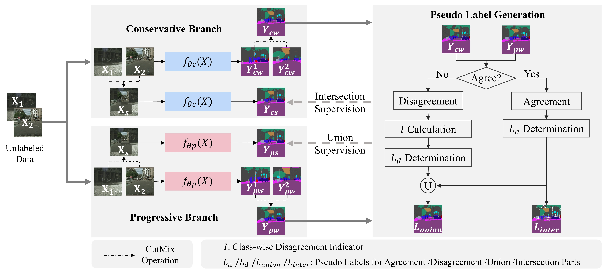
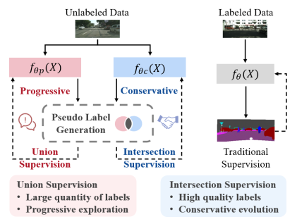
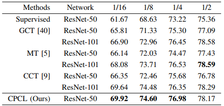
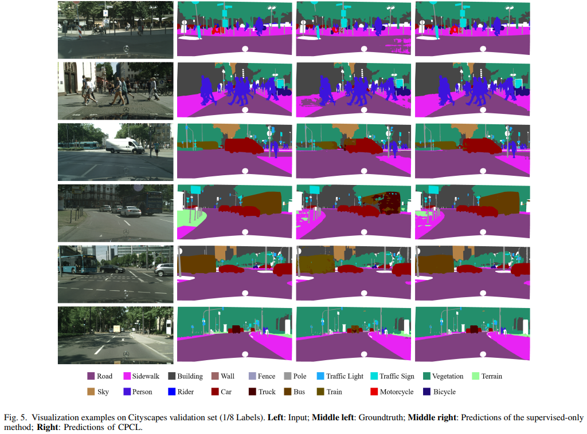
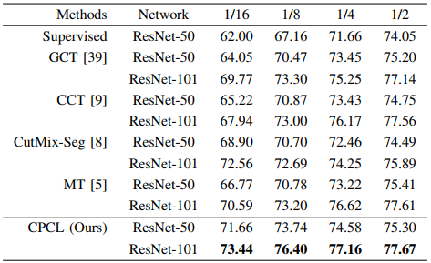
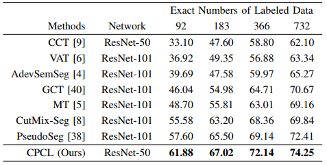
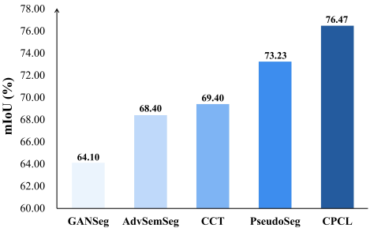

# CPCL: Conservative-Progressive Collaborative Learning for Semi-supervised Semantic Segmentation



> For technical details, please refer to:
>
> [Conservative-Progressive Collaborative Learning for Semi-supervised Semantic Segmentation](https://ieeexplore.ieee.org/document/10042237)

## (0) Abstract

Pseudo supervision is regarded as the core idea in semi-supervised learning for semantic segmentation, and there is always a tradeoff between utilizing only the high-quality pseudo labels and leveraging all the pseudo labels. Addressing that, we propose a novel learning approach, called Conservative-Progressive Collaborative Learning (CPCL), among which two predictive networks are trained in parallel, and the pseudo supervision is implemented based on both the agreement and disagreement of the two predictions. One network seeks common ground via intersection supervision and is supervised by the high-quality labels to ensure a more reliable supervision, while the other network reserves differences via union supervision and is supervised by all the pseudo labels to keep exploring with curiosity. Thus, the collaboration of conservative evolution and progressive exploration can be achieved. To reduce the influences of the suspicious pseudo labels, the loss is dynamic re-weighted according to the prediction confidence. Extensive experiments demonstrate that CPCL achieves state-of-the-art performance for semi-supervised semantic segmentation.




## (1) Setup

This code has been tested with Python 3.6, PyTorch 1.0.0 on Ubuntu 18.04.

* Setup the environment
  ```bash
  conda create -n CPCL python=3.6
  source activate CPCL
  conda install pytorch==1.0.0 torchvision==0.2.2
  ```

* Clone the repository

* Install the requirements
  ```bash
  pip install -r requirements.txt
  ```
  
* Download pertained models
  * Download the pretrained models for evaluation

      | Dataset                  | Setting                     | Baidu Cloud                                                      |  Google Drive                   |
      |--------------------------|-----------------------------|------------------------------------------------------------------|---------------------------------|
      | Cityscapes               | Semi-Supervision(ResNet50)  |[Download](https://pan.baidu.com/s/1C1zk3PKGGBUhHLvxYQjp4g): upg7 | [Download](https://drive.google.com/file/d/1Cpm_sd_Eg4Y6EFs6R8ULbbWtj629JcD7/view?usp=sharing)
      | PascalVOC                | Semi-Supervision(ResNet50)  |[Download](https://pan.baidu.com/s/1StgPaJpHVgwmP1iGvzkCFg): ee81 | [Download](https://drive.google.com/file/d/13Rso-lCzku0Hcqf7swHR8nijYVSHe13y/view?usp=sharing)
      |                          | Semi-Supervision(ResNet101) |[Download](https://pan.baidu.com/s/1oXhsJRdk2XzzT2QKvk-gpw): xrpj | [Download](https://drive.google.com/file/d/1xms4nLRkF_OQqLdFIjBs6uhaPdWN2nJ1/view?usp=sharing)
      |                          | Few-Supervision(ResNet50)   |[Download](https://pan.baidu.com/s/1kpdvFp0Az12zKG_ZFBwt-Q): 5ygh | [Download](https://drive.google.com/file/d/1Vjfmd7GNZFpY8iuLRKHpXMRnJUPrcR5E/view?usp=sharing)
      |                          | Full-Supervision(ResNet50)  |[Download](https://pan.baidu.com/s/1oYzE9RSqgwuKno1vrFtA6g): dc2j | [Download](https://drive.google.com/file/d/1xulOqS66sP1xpevxxtxxwRFVA9ia1aQ7/view?usp=sharing)
    
    > Notes: We only uploaded several representative pretrained models (data partition = 1/8) to GoogleDrive due to the space limitation. You can achieve the whole buckets of pretrained models from BaiduCloud.

  * Download the ResNet-50/ResNet-101 for training and move it to ./DATA/pytorch-weight/

      | Model                    | Baidu Cloud  |
      |--------------------------|--------------|
      | ResNet-50                | [Download](https://pan.baidu.com/s/1agsf6BSvmVVGTvk23JXxaw): skrv |
      | ResNet-101               | [Download](https://pan.baidu.com/s/1PLg22P_Nv9GwR-KEzGdvTA): 0g8u |

## (2) Cityscapes

* Data preparation
  
  Download the "city.zip" followed [CPS](https://pkueducn-my.sharepoint.com/personal/pkucxk_pku_edu_cn/_layouts/15/onedrive.aspx?id=%2Fpersonal%2Fpkucxk%5Fpku%5Fedu%5Fcn%2FDocuments%2FDATA&ga=1), and move the upcompressed folder to ./DATA/city

* Modify the configuration in [config.py](./exp_city/config.py)
  * Setup the path to the CPCL in line 24
    ```python
    C.volna = '/Path_to_CPCL/'
    ```
  * [**Optional**] Modify the data partitions in line 62 & 63 to try partitions beside 1/8

    

    ```python
    C.labeled_ratio = 8
    C.nepochs = 137
    ```
    > The recommended nepochs for batch_size=16 corresponding to the labeled_ratio are listed as below
    > | Dataset    | 1/16 | 1/8  | 1/4  | 1/2  |
    > | ---------- | ---- | ---- | ---- | ---- |
    > | Cityscapes | 128  | 137  | 160  | 240  |
  
* Training
  ```bash
  cd exp_city
  python train.py
  ```
  > If you meet *ImportError: libmkldnn.so.0: undefined symbol: cblas_sgemm_alloc*
  >
  > Here is a possible solution: conda install mkl=2018 -c anaconda

* Evaluation
  ```bash
  cd exp_city
  python eval.py -e $model.pth -d $GPU-ID
  # add argument -s to save demo images
  python eval.py -e $model.pth -d $GPU-ID -s
  ```
  > There are four evaluation modes:
  > 1. Only eval a .pth model: -e *.pth
  > 2. Only eval a certain epoch: -e epoch
  > 3. Eval all epochs in a given section: -e start_epoch-end_epoch
  > 4. Eval all epochs from a certain started epoch: -e start_epoch-



## (3) PascalVOC

* Data preparation
  
  Download the "pascal_voc.zip" at [BaiduCloud](https://pan.baidu.com/s/1x86kqXAFU9q3-lYPFN_7dw): o9b3, and move the upcompressed folder to ./DATA/pascal_voc

* Modify the configuration in [config.py](./exp_voc/config.py)
  * Setup the path to the CPCL in line 25
    ```python
    C.volna = '/Path_to_CPCL/'
    ```
  * [**Optional**] Modify the data partitions in line 62 & 63 to try partitions beside 1/8

    

    ```python
    C.labeled_ratio = 8
    C.nepochs = 34
    ```
    > The recommended nepochs for batch_size=8 corresponding to the labeled_ratio are listed as below
    > | Dataset    | 1/16 | 1/8  | 1/4  | 1/2  |
    > | ---------- | ---- | ---- | ---- | ---- |
    > | PascalVOC  | 32   | 34   | 40   | 60   |
  *  [**Optional**] Modify the dataset sources in line 62-67 for few-supervision experiments 

       

       ```python
       C.labeled_ratio = 8
       C.nepochs = 34
       C.train_source = osp.join(C.dataset_path, 'subset_train_aug/train_pseudoseg_labeled_1-{}.txt'.format(C.labeled_ratio))
       C.unsup_source = osp.join(C.dataset_path, 'train_aug.txt')
       ```
  *  [**Optional**] Modify the dataset sources in line 66 & 67 for full-supervision experiments 

       

       ```python
       C.train_source = osp.join(C.dataset_path,'train.txt')
       C.unsup_source = osp.join(C.dataset_path, 'train_aug.txt')
       ```
  
* Training
  ```bash
  cd exp_voc
  python train.py
  ```
  > If you meet *ImportError: libmkldnn.so.0: undefined symbol: cblas_sgemm_alloc*
  >
  > Here is a possible solution: conda install mkl=2018 -c anaconda

* Evaluation
  ```bash
  cd exp_voc
  python eval.py -e $model.pth -d $GPU-ID
  ```

## Citation

If you find our work useful in your research, please consider citing:

```
@ARTICLE{10042237,
  author={Fan, Siqi and Zhu, Fenghua and Feng, Zunlei and Lv, Yisheng and Song, Mingli and Wang, Fei-Yue},
  journal={IEEE Transactions on Image Processing}, 
  title={Conservative-Progressive Collaborative Learning for Semi-supervised Semantic Segmentation}, 
  year={2023},
  volume={},
  number={},
  pages={1-1},
  doi={10.1109/TIP.2023.3242819}}
```

### Acknowledgment

Part of our code refers to the work [CPS](https://github.com/charlesCXK/TorchSemiSeg)


